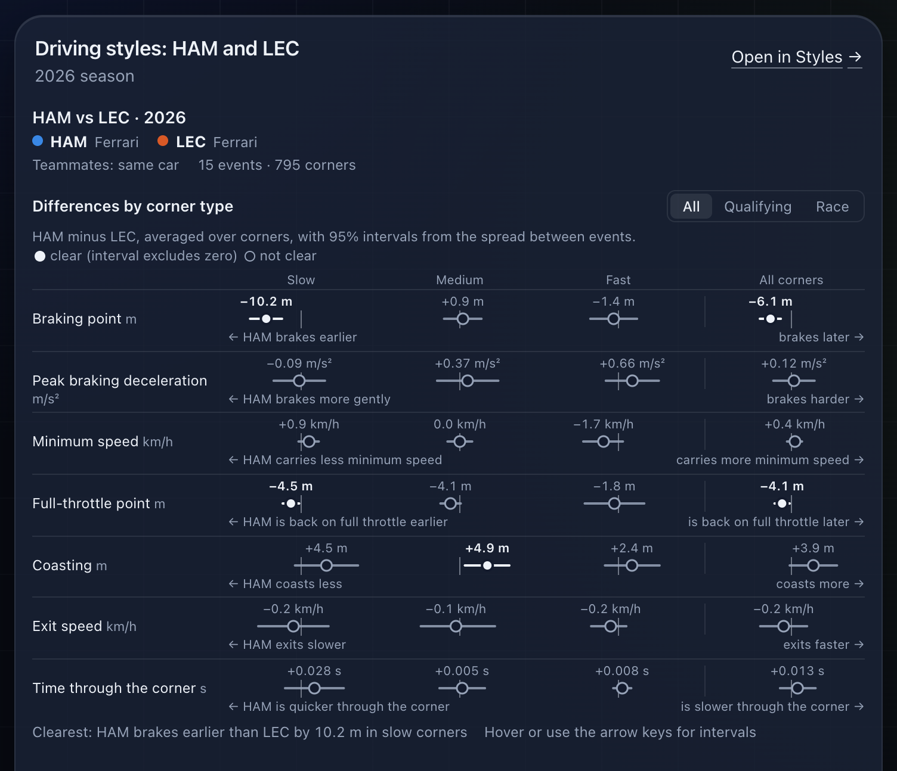
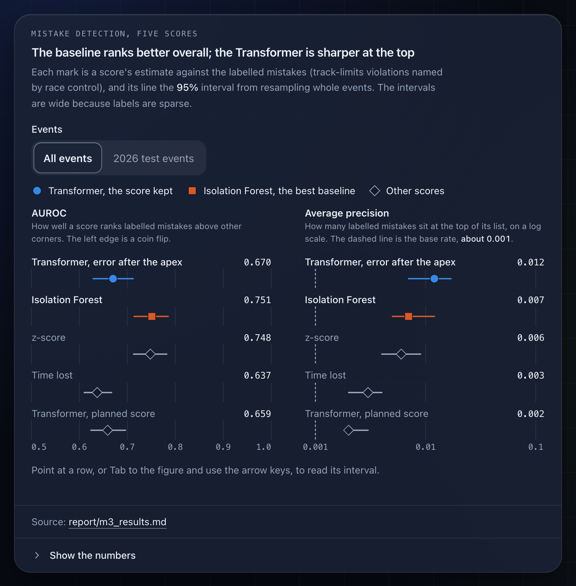
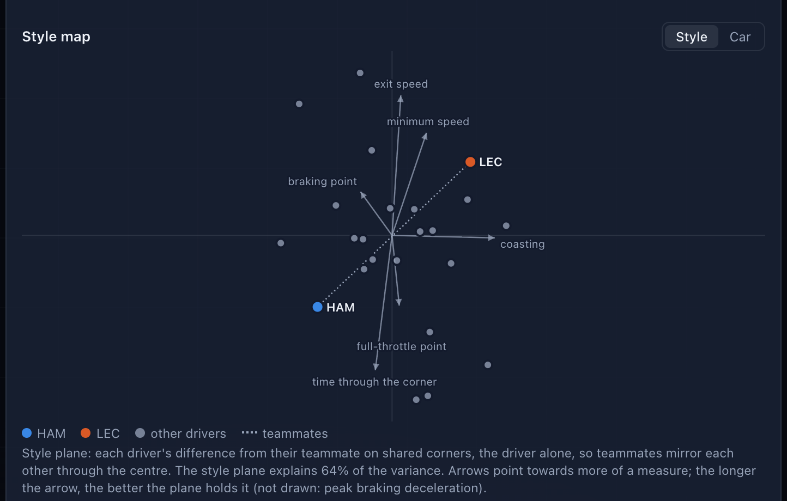

# Race Engineer AI

Deep learning on Formula 1 car telemetry: a self-supervised Transformer that **spots driver
mistakes** (lock-ups, running wide, late throttle) and **compares driving styles**, made
conversational through Claude. Ask "Where did Gasly make mistakes in the 2025 Abu Dhabi race?"
and get an answer with an interactive telemetry chart, on the website or inside Claude.

[](https://github.com/yunichun16/race-engineer-ai/actions/workflows/ci.yml)

*Unofficial fan project, not affiliated with Formula 1 or the FIA. Findings can be wrong.*

## Try it

- **The website:** [race-engineer-three.vercel.app](https://race-engineer-three.vercel.app):
  the chat, the mistake explorer, teammate styles and the report. It also runs locally in two
  commands (see [Quick start](#quick-start)).
- **Inside Claude:** the same tools work as a custom connector, with their charts drawn in the
  conversation and nothing to install. In Claude: Settings → Connectors → Add custom connector →
  name it "Race Engineer", URL `https://yunichun16--race-engineer-api.modal.run/mcp`, leave the
  sign-in fields empty → enable it in a new chat from the tools menu → ask "Summarise the 2023
  Monaco Grand Prix." Custom connectors work on Claude's Free plan (one connector), Pro, Max,
  Team and Enterprise. To run the tools locally in the Claude desktop app instead, see
  [The MCP server in the Claude desktop app](#the-mcp-server-in-the-claude-desktop-app).
- **The demo video:** 
https://github.com/user-attachments/assets/1847d401-748a-497c-8d0e-7d7c33144b18


## Screenshots

Position-free views from the site (no track maps, replays or running orders).

| A chat answer's chart | The detector comparison | The style map |
|---|---|---|
|  |  |  |

## What it does

- **For F1 fans:** ask about any qualifying, sprint or race since 2022 in plain words, browse
  the corners the model flagged race by race, and compare how teammates drive the same car.
- **For machine-learning readers:** a Transformer trained on telemetry without labels, compared
  with simple baselines on a temporal split, with intervals and limits stated.
- **For Claude users:** seven analysis tools as an MCP server, five of them answering with an
  interactive chart inside the conversation.

The project asks three research questions, each answered in its report:

1. **Can it find driver mistakes?** Partly: a simple baseline ranks labelled mistakes better
   overall, the Transformer is sharper at the very top of its list, and the two together do best
   ([report/m3_summary.md](report/m3_summary.md), [report/m4_summary.md](report/m4_summary.md)).
2. **Can it tell drivers apart?** Within a season, yes, but mostly by the car: style is measured
   as the difference between teammates ([report/m3_summary.md](report/m3_summary.md),
   [report/m4_style.md](report/m4_style.md)).
3. **What did the 2026 rule change do?** Most of the jump in error is the new tracks, not the new
   cars ([report/m3_summary.md](report/m3_summary.md), [report/m3_shift.md](report/m3_shift.md)).

One set of tools (`engine/src/race_engineer/tools/`) is served three ways with the same
descriptions, inputs and answers: by the MCP server, by a REST API, and by a chat where Claude
Sonnet 5.5 picks the tools. The model reads each tool's text summary; the chart data goes to the
chart only.

| Tool | Answers | Chart |
|---|---|---|
| `find_session` | which processed session the user means ("the last race", "Monza quali") | — |
| `list_sessions` | every processed session, by season and weekend | — |
| `get_race_summary` | a race or sprint as timed: order, gaps, safety cars, pit stops, stints | positions lap by lap |
| `find_mistakes` | the biggest driver mistakes in a session, with time lost and an explanation | list and track map |
| `explain_corner` | one corner on one lap against the driver's usual | traces, map and replay |
| `compare_laps` | two drivers' laps: where one gained on the other | speed, gap, pedals |
| `compare_driving_styles` | how two drivers take corners over a season | differences and a style map |

## How it fits together

```
 Offline (a Mac, or a Modal GPU for training)
 FastF1 ──► data pipeline ──► Parquet ──► Transformer (PyTorch) ──► scoring, mistakes, styles
                                                                          │  served-data bundle
                                                                          ▼
 ┌─ Vercel ──────────────────────────┐  CORS  ┌─ Modal ───────────────────────────────────┐
 │ Next.js site: static pages, CSP   │──────► │ FastAPI: REST tools, chat, saved answers  │──► Claude API
 │ snapshots and saved answers       │        │ /mcp: the MCP server, charts as MCP Apps  │    (Sonnet 5.5)
 │ copied from the API at build time │        │ data on a read-only Modal Volume          │
 └───────────────────────────────────┘        └───────────────┬───────────────────────────┘
                                                              │ question counts, daily spend
 Claude (custom connector) ──────────────────► /mcp           ▼
                                                        Upstash Redis
```

- **The site** (`web/`, Next.js on Vercel) is static: every page reads with the API down, and the
  browser calls the API directly. Its five charts are the same code that draws them inside
  Claude. [web/README.md](web/README.md)
- **The API** (`engine/`, FastAPI on Modal) serves the tools, the chat and `/mcp` from one
  container, scaled to zero when idle, on a read-only copy of the processed data.
  [engine/README.md](engine/README.md)
- **The chat** keeps no transcripts: the browser sends the conversation back with each question,
  signed by the server. Its limits (below) live in Upstash Redis; when they can't be read, the
  chat turns off and the site shows saved example answers, while the tools keep working.
- **Claude** reaches the same tools through `/mcp`, server to server, as a custom connector.

## Results

What the model found, with the numbers the website shows (each pinned to its report by a test).
The full write-up is the [technical report](report/technical_report.md), and the model is
described in its [model card](report/model_card.md).

| Question | Finding | Report |
|---|---|---|
| Mistakes (RQ2) | Isolation Forest, a simple baseline, ranks labelled mistakes better overall (AUROC 0.75 against 0.67), but the Transformer is sharper at the top: 7 of its 50 highest-scoring corners, against 1. Combined, the two reach an average precision of 0.033 [0.007, 0.096] on the 2026 test events, against 0.017 for each alone, within wide intervals. | [m3_summary.md](report/m3_summary.md), [m4_summary.md](report/m4_summary.md) |
| What a flag means | Of 18,762 flagged corners, 56% were not clearly slower than the driver's usual. 1,648 distinct driving mistakes remain, costing 0.37 s at the median. | [m4_summary.md](report/m4_summary.md) |
| Style (RQ1) | Within a season, a probe on the embedding names the team from a single corner 44% of the time (hand-crafted features: 29%); across seasons the order flips (8.8% against 11% for the driver). Teammates' centroids have a median cosine of 0.92, so style is measured between teammates. | [m3_summary.md](report/m3_summary.md), [m4_style.md](report/m4_style.md) |
| The 2026 rules (RQ3) | Reconstruction error rises about 10% from 2025 to 2026, but only about 4% on the same circuits; fine-tuning on 2026 races lowers it by 0 to 1.2%: small and not firmly established. | [m3_summary.md](report/m3_summary.md), [m3_shift.md](report/m3_shift.md) |
| Serving | The scorer runs without PyTorch as an ONNX model, with the same answers: largest relative difference 1.1e-05 against a gate of 1e-04. | [m4_onnx.md](report/m4_onnx.md) |

The findings haven't been checked at scale yet: a larger human review is planned. How the
system was built and measured: [report/m5_backend.md](report/m5_backend.md) (tools, API, chat,
MCP), [report/m6_website.md](report/m6_website.md) (the site) and
[report/m7_ship.md](report/m7_ship.md) (guardrails and deployment). The chat's use of the tools
is checked with 15 fixed questions (`make chat-eval`); its results stay in the repository, in
[report/m7_chat_accuracy.md](report/m7_chat_accuracy.md).

## Quick start

Requires [uv](https://docs.astral.sh/uv/) and Node.js 22.18 or later (CI uses 24: the web tests
and scripts run TypeScript with Node's own type stripping).

```bash
make setup      # install the Python and web dependencies
make check      # lint, type checks, tests (synthetic data: no dataset, network or API key needed)
make mcp-app    # build the chart bundles the MCP server serves inside Claude
```

The website and the API it calls, in two terminals:

```bash
make api-fake   # the API at http://127.0.0.1:8000, with a scripted chat (no API key needed)
make web        # the site at http://localhost:3000
```

Without the dataset the API still starts and `/api/health` says what is missing. To rebuild the
data and the model's results (the data comes from FastF1 and is never committed):

```bash
make data             # download and process every session (resumable; ~7 h for everything)
make qa               # report/data_quality.md
make experiments      # train the Transformer and its ablations (~10 h on a Mac GPU; or make cloud-train)
make select-model CHECKPOINT=models/ablations/<run>/baseline.pt
make m4               # score every corner, explain and cost the flags, profile the styles
```

The processed data takes about 6 GB, next to a 19 GB FastF1 cache, so allow about 30 GB of disk
in all. The trained weights are published as a
[GitHub Release](https://github.com/yunichun16/race-engineer-ai/releases/tag/v1.0), so scoring
can start from them instead of a training run (see the
[model card](report/model_card.md#getting-the-weights)). Every step and what it writes:
[engine/README.md](engine/README.md) and the technical report's
[Reproducing it](report/technical_report.md#reproducing-it).

**The real chat** needs your own Anthropic API key: run `make api` instead of `make api-fake`,
from a terminal where `ANTHROPIC_BASE_URL` is unset or is the Claude API itself
(`https://api.anthropic.com`). Any other base URL would see every question and the key, and the
API warns about it at startup. `/api/health` then reports `"mode": "anthropic"`.

**Checks on real data** (not in CI): `make mcp-smoke` (every tool and chart over MCP),
`make chat-smoke` (the chat's example questions), `make site-smoke` (the running site end to
end) and `make chat-eval` (the 15 accuracy questions).

### The MCP server in the Claude desktop app

Add this to Claude's config (Settings → Developer → Edit Config), then restart the app and ask
Claude to "show the sample telemetry":

```json
{
  "mcpServers": {
    "race-engineer": {
      "command": "uv",
      "args": ["--directory", "/absolute/path/to/race-engineer/engine", "run", "race-engineer-mcp"]
    }
  }
}
```

Use the full path to `uv` (`which uv`) if Claude can't find it. With the processed data and the
results, it answers real questions with its seven tools: "what's the most recent race you can
analyse?", "summarise the 2023 Monaco Grand Prix", "where did Gasly make mistakes in the 2025
Abu Dhabi race?", "what went wrong at the corner where he lost the most?", "how does Hamilton's
style differ from Leclerc's?". Run `make mcp-app` and restart the app after changing the charts.

## Deploy your own

The site deploys to Vercel, the API to Modal (or, as a fallback, Google Cloud Run), and the
chat's limits use Upstash Redis, all on free plans except the Anthropic API itself (the Cloud
Run fallback needs a billing account with a card, and costs a few cents a month).
[docs/DEPLOY.md](docs/DEPLOY.md) is the step-by-step guide: the accounts, the secrets, the data
upload, the deploy, the checks, the Claude connector, pausing the chat, updating the data,
rolling back, and what it costs.

## Repository layout

| Folder | What's in it |
|---|---|
| `engine/` | Python (uv): data pipeline, models, evaluation, analysis tools, the API with its guardrails, the MCP server, and the deploy files (`modal_api.py`, `Dockerfile`) |
| `web/` | The Next.js site, and the chart bundles shown inside Claude (`web/src/mcp-app/`) |
| `report/` | The [technical report](report/technical_report.md), the [model card](report/model_card.md), the [dataset card](report/dataset_card.md) and every milestone's reports |
| `docs/` | [DEPLOY.md](docs/DEPLOY.md) (deploying it) and [demo.md](docs/demo.md) (the demo video) |
| `.github/` | CI ([ci.yml](.github/workflows/ci.yml)): lint, type checks and tests for both sides, the site's build and its size budgets, the API's serve-only install, a repository check that no data, weights, videos or secrets are tracked, and an end-to-end run on made-up data; and a manual-only API deploy ([deploy-api.yml](.github/workflows/deploy-api.yml)) |
| `Makefile` | Every command in these docs, each target with a one-line comment |

## Limits and responsible use

- **Findings can be wrong.** A flagged corner is a lead to check against the replay, not a
  verdict. Not for officiating, betting, judging a driver's ability or safety decisions.
- **Coarse data.** About 4 samples per second, and the brake is on or off. The only labels are
  track-limits violations named by race control.
- **Context it can't see.** In 2026, lifting and coasting can be energy management, not a
  mistake; drivers of different teams mix car and driver.
- **The chat's limits.** On the deployed site: 10 questions an hour and 25 a day per connection,
  8 per conversation, and a daily spending cap for the whole demo. When a limit is reached, the
  chat shows answers it gave earlier.
- **Privacy.** To keep this free demo within budget, the server counts questions per connection
  using a scrambled, daily-changing code made from your IP address, deleted within about a day.
  It stores no IP addresses, no cookies and no questions; your conversation lives only in this
  browser tab. The hosting services (Vercel, Modal) keep their own short-lived request logs.

The full list is in the technical report's [Limitations](report/technical_report.md#limitations).

## Milestones

| | Milestone | Status |
|---|---|---|
| M0 | Setup + MCP Apps spike | done |
| M1 | Data pipeline (FastF1 → aligned corner segments) | done: [dataset card](report/dataset_card.md), [quality report](report/data_quality.md) |
| M2 | Baselines + evaluation harness | done: [report/baselines.md](report/baselines.md) |
| M3 | Telemetry Transformer (masked autoencoder) | done: [report/m3_summary.md](report/m3_summary.md) |
| M4 | Inference: mistakes, time lost, style profiles | done: [report/m4_summary.md](report/m4_summary.md) |
| M5 | Backend + MCP tools | done: [report/m5_backend.md](report/m5_backend.md) |
| M6 | Website | done: [report/m6_website.md](report/m6_website.md) |
| M7 | Guardrails, deploy, technical report | done, live at [race-engineer-three.vercel.app](https://race-engineer-three.vercel.app) ([docs/DEPLOY.md](docs/DEPLOY.md)): [report/m7_ship.md](report/m7_ship.md), [technical report](report/technical_report.md), [model card](report/model_card.md) |
| M8 | Native iOS app (SwiftUI on the deployed API) | planned |

## Data and licensing

The code is MIT-licensed ([LICENSE](LICENSE)). F1 data comes from
[FastF1](https://github.com/theOehrly/Fast-F1) for non-commercial, educational use and is not
redistributed here: the pipeline rebuilds it, and the deployed API serves a private copy. The
model weights are published as assets of the GitHub Release
[v1.0](https://github.com/yunichun16/race-engineer-ai/releases/tag/v1.0)
([model card](report/model_card.md#getting-the-weights)).

*Unofficial project, not affiliated with Formula 1 or the FIA.*

## Credit

Built by **Yuchun Wu**: [GitHub](https://github.com/yunichun16) ·
[LinkedIn](https://www.linkedin.com/in/yuchun-wu)
