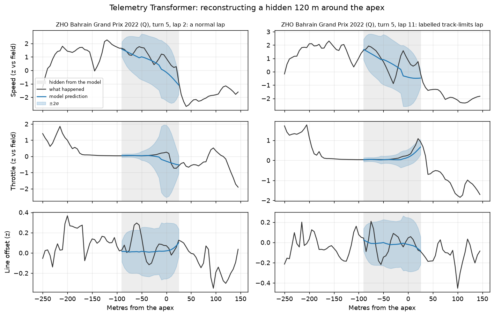
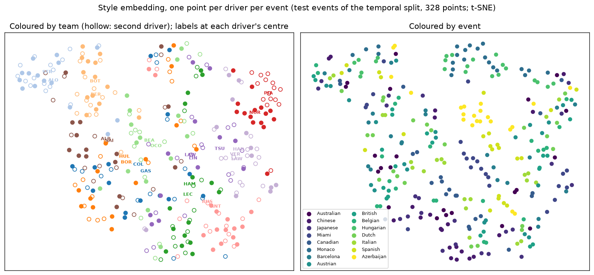
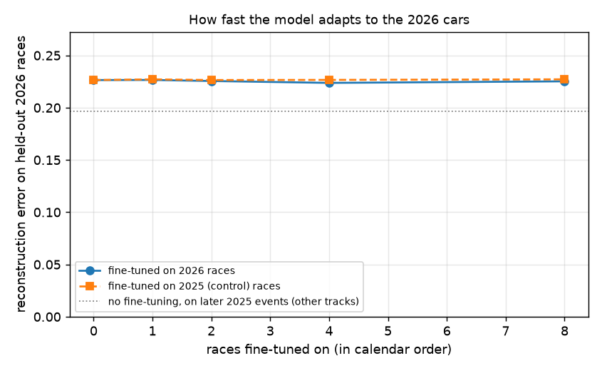

# Race Engineer AI: technical report

Race Engineer AI looks for driver mistakes and differences in driving style in Formula 1 car telemetry, with a Transformer trained without labels, and answers questions about them through Claude: on a website, and inside Claude itself. This report brings the project's reports together: the questions, the data, the method, what was found, how it is served, and where it falls short. Every number in it is copied from the report it links, and a test (`web/src/lib/report/trace.test.ts`) checks that each one still appears there. It is an unofficial fan project, not affiliated with Formula 1 or the FIA ([dataset card](dataset_card.md)), and a finding can be wrong.

## Summary

- **Data.** All 263 qualifying, sprint and race sessions of 2022-2026, cut into 1.86 million eligible corner segments, 1,609 of them labelled as mistakes: a lap time deleted for track limits, named by race control.
- **Mistakes (RQ2).** On all events the simple Isolation Forest ranks labelled mistakes better overall (AUROC 0.75 against 0.67), but the Transformer is sharper at the top of its list: 7 of its 50 highest-scoring corners, against 1. The two together do best, 0.033 [0.007, 0.096] against 0.017 for each in average precision on the 2026 test events, within wide intervals.
- **Explanations.** Of 18,762 flagged corners, 56% were not clearly slower than the driver's usual. 1,648 distinct driving mistakes remain, costing 0.37 s at the median. In races most of the costliest flags were other cars, which a traffic rule now sets apart.
- **Style (RQ1).** Within 2026 the embedding names the team from a single corner 44% of the time (hand-crafted features: 29%), but it is mostly the car: teammates' centroids have a median cosine of 0.92. So style is measured between teammates, who differ measurably by small amounts: in 95% of pair-seasons at least one of seven metrics differs clearly, against 29% by chance.
- **The 2026 rule change (RQ3).** Reconstruction error rises about 10% from 2025 to 2026, but only about 4% on the same circuits, and fine-tuning on 2026 races barely moves it.
- **Ablations.** Little matters: the variants sit within each other's intervals, and the model makes little use of its context tokens. A CNN reconstructs about as well but finds far fewer mistakes at the top of its list.
- **Serving.** The scorer runs without PyTorch as an ONNX model, with the same answers (the largest relative difference was 1.1e-05). Seven tools answer questions through an MCP server that draws charts inside Claude, a REST API, a chat with Claude Sonnet 5.5 and a website, with limits on what the chat may use and spend.

_Sources: [m3_summary.md](m3_summary.md), [m4_summary.md](m4_summary.md), [m4_style.md](m4_style.md), [m4_onnx.md](m4_onnx.md), [m5_backend.md](m5_backend.md)_

## Research questions

1. **RQ1, driving style.** Does a model trained on telemetry alone, without labels, learn how a driver or a team takes a corner, well enough to tell drivers apart and to compare teammates?
2. **RQ2, mistakes.** Can it find driver mistakes, ranking them better than simple baselines, and say what went wrong and what it cost?
3. **RQ3, the 2026 rule change.** The 2026 cars are a new generation. How far does the change shift a model trained on earlier seasons, and how fast does it adapt?

The questions come from the project's plan, which isn't in the repository; findings 1-3 of [m3_summary.md](m3_summary.md) answer them for the model, and the [README](../README.md) describes the project.

## Data

The data is Formula 1's live-timing feed, read with [FastF1](https://github.com/theOehrly/Fast-F1) 3.8: every qualifying, sprint qualifying, sprint and race session of 2022-2026, up to round 15 of 2026 (Azerbaijan), 263 sessions. It belongs to Formula 1 and is used here for non-commercial research and education. It is not redistributed: the pipeline rebuilds it locally, and since FastF1 allows 500 API calls per hour, a full build takes about 7 hours.

**How it's built.** Each lap's car data (speed, throttle, brake, gear, RPM and DRS, at about 4 samples per second) and its position fixes are aligned on the distance around the track, measured against a reference lap, and resampled every 5 m. Around every official turn a window from 250 m before to 150 m after the apex (80 grid points) is cut out: a **corner segment**, the unit everything else works on. Stretches where a feed froze, stalled or disagreed with itself are marked invalid, and windows that touch them are dropped. The result is seven tables, one Parquet file per session each, with DuckDB views over them: `sessions`, `tracks`, `corners`, `laps`, `lap_grids`, `segments` and `events`.

**Coverage.** 263 sessions, 168,709 laps, 144,373 lap grids, 2,314,096 corner segments. 2,907 corner windows were skipped (the neighbouring lap had no grid) and 40,698 dropped for touching invalid data. Push laps in qualifying and racing laps are the clean laps used for modelling; slow race laps are kept for evaluating mistake detection, because going off track is itself a common reason for a slow lap. The models use the 1.86 million eligible corner segments.

**Weak labels.** The only labels are track-limits violations: a lap time deleted for exceeding track limits at a named turn, from FastF1's deleted-lap flag and race-control messages. Driver, lap and turn are exact, so each points at one segment; 1,609 eligible segments carry one. Race control's notes on driving incidents (776, lap-level and approximate) are kept as context. When several drivers are flagged at the same lap and turn, something on track usually pushed everyone wide, so detection is scored only against single-corner labels.

_Sources: [dataset_card.md](dataset_card.md), [data_quality.md](data_quality.md), [m3_summary.md](m3_summary.md), [baselines.md](baselines.md)_

## Splits and evaluation

The main split is by season, so the test is a new year: train on 2022-2024, validate on 2025 and test on 2026, the first year of the new cars (the `temporal` split).

| split | events | segments | labelled mistakes |
|---|---|---|---|
| train, 2022-2024 | 68 | 1,211,573 | 1,083 |
| validation, 2025 | 24 | 442,570 | 347 |
| test, 2026 | 15 | 208,916 | 179 |

A second split holds out whole circuits instead (`leave_tracks_out`, for the `unseen_tracks` variant): 68 / 20 / 19 events, 1,134,337 / 379,465 / 349,257 segments.

Detectors rank corner segments by how unusual they are and are scored against the single-corner track-limits labels: AUROC, average precision (AP), precision in the top 50 and 200 corners (P@50, P@200), and recall in the top 1% and 5%. Mistakes are rare (a base rate of 0.0009, about 1 labelled mistake per 1,156 segments) and many are unlabelled, so the scores compare detectors with each other rather than against a perfect score. Intervals are 95% intervals from resampling whole events. Every choice of score is made on the validation events only and reported on the test events. No detector sees a label, so scoring every event is also fair, and it gives tighter intervals.

_Sources: [baselines.md](baselines.md), [m3_ablations.md](m3_ablations.md), [m3_results.md](m3_results.md)_

## Baselines

Four baselines score how unusual a corner segment is for that driver at that corner in that session, so style and car differences don't count as mistakes ([`baselines.py`](../engine/src/race_engineer/models/baselines.py)): time lost against the driver's usual (`time_loss`), the root-mean-square of the driver-relative z-scores of the hand-crafted features (`z_score`), an Isolation Forest on the same z-scores (`isolation_forest`), and the reconstruction error of the raw traces under PCA, the linear cousin of the autoencoder (`pca_trace`). Isolation Forest and PCA were fit on the training events only. On the test events:

| detector | AUROC [95% CI] | avg precision [95% CI] | P@50 |
|---|---|---|---|
| `time_loss` | 0.671 [0.627, 0.707] | 0.007 [0.002, 0.019] | 0.04 |
| `z_score` | 0.814 [0.719, 0.888] | 0.017 [0.003, 0.080] | 0.1 |
| `isolation_forest` | 0.821 [0.727, 0.893] | 0.022 [0.003, 0.096] | 0.1 |
| `pca_trace` | 0.781 [0.689, 0.852] | 0.006 [0.002, 0.014] | 0 |

M3's evaluation ran these baselines again next to the Transformer (below); its Isolation Forest scores differ from these in the third decimal.

**Which driver took this corner?** From the hand-crafted features, logistic regression names the right one of 19 drivers 0.11 of the time (chance 0.053), and 0.153 when a whole lap's corners vote. Teammates, who share a car, are told apart with a segment accuracy of 0.594 (chance 0.5), 0.684 for a whole lap.

_Sources: [baselines.md](baselines.md)_

## The model

The Telemetry Transformer is a masked autoencoder. Each corner segment's five signal channels (speed, throttle, brake, gear and line offset, normalised per corner and session) are cut into 40 m patches; some are hidden, and the Transformer predicts them, with its own uncertainty for each point. It trains on that alone, on the negative log-likelihood of what actually happened, and never sees a label. Context tokens carry the lap's context (tyres, fuel, traffic, weather, session), and a [CLS] token gives a 64-dimensional embedding of the corner, which is used for style.

| setting | the kept model (the `baseline` variant) |
|---|---|
| network | Transformer encoder, 4 layers, `d_model` 128, 4 attention heads |
| input | 5 signal channels by 80 points, plus the context |
| objective and masking | negative log-likelihood (`nll`), mask ratio 0.5 |
| parameters | 576k |
| training | 20 epochs (best 15), batches of 512, learning rate 1e-3 after 300 warm-up steps |
| training data | 1,211,573 segments of 2022-2024 |
| time | 13.0 min on one cloud GPU (`engine/modal_app.py`) |
| checkpoint | `baseline.pt`, epoch 15, validation NLL -0.9111 |

Four mistake scores come out of one scoring step, in which five complementary masks predict each 40 m patch once without seeing itself: `mae_nll`, the model's surprise at what actually happened, weighted by its own predicted uncertainty (the planned score); `mae_error`, the mean squared reconstruction error; `mae_error_exit`, the error in speed and line offset from the apex to 150 m after it; and `mae_error_speed_patch`, the worst 40 m of speed.

_Sources: [m3_ablations.md](m3_ablations.md), [m3_results.md](m3_results.md), [m4_onnx.md](m4_onnx.md), [`ablations.toml`](../engine/configs/ablations.toml)_

## Finding mistakes (RQ2)

### The Transformer against the baselines

The planned score, `mae_nll`, turned out to be a weak detector: the model learns that corner exits are naturally variable, so it discounts exactly where most mistakes happen. Plain reconstruction error works better, and `mae_error_exit` was chosen on the validation events only.

| detector | AUROC, all events [95% CI] | AP, all events [95% CI] | P@50, all | AUROC, test events [95% CI] | AP, test events [95% CI] |
|---|---|---|---|---|---|
| `mae_nll` (planned) | 0.659 [0.624, 0.696] | 0.002 [0.002, 0.003] | 0 | 0.678 [0.563, 0.761] | 0.002 [0.001, 0.005] |
| `mae_error_exit` (chosen) | 0.670 [0.629, 0.712] | 0.012 [0.007, 0.017] | 0.14 | 0.711 [0.605, 0.793] | 0.022 [0.005, 0.063] |
| `time_loss` | 0.637 [0.610, 0.667] | 0.003 [0.002, 0.004] | 0.02 | 0.671 [0.627, 0.707] | 0.007 [0.002, 0.019] |
| `z_score` | 0.748 [0.713, 0.782] | 0.006 [0.004, 0.009] | 0.04 | 0.814 [0.719, 0.888] | 0.017 [0.003, 0.080] |
| `isolation_forest` | 0.751 [0.714, 0.785] | 0.007 [0.005, 0.012] | 0.02 | 0.820 [0.722, 0.893] | 0.022 [0.003, 0.090] |

On all events, Isolation Forest has the best AUROC (0.75 against 0.67 for the Transformer's chosen score). But the Transformer's reconstruction error after the apex puts more labelled mistakes at the very top of its list: 7 of its 50 highest-scoring corners, against 1 for Isolation Forest, and a higher average precision (0.012 against 0.007; the intervals overlap). On the 2026 test events alone the two tie on average precision (0.022). Labels are sparse (179 in the test year), so every interval is wide.

_Sources: [m3_summary.md](m3_summary.md), [m3_results.md](m3_results.md)_

### Two detectors together

M4 combines the two. Each score becomes a percentile within its session, and the combination was chosen by average precision on the validation events only: the mean, which needs both detectors to find a corner unusual.

| candidate | AP, validation | AP, test [95% CI] | AUROC, test | P@50, test |
|---|---|---|---|---|
| Transformer | 0.013 | 0.017 [0.005, 0.042] | 0.721 | 0.06 |
| Isolation Forest | 0.011 | 0.017 [0.004, 0.059] | 0.819 | 0.04 |
| **mean (chosen)** | 0.023 | 0.033 [0.007, 0.096] | 0.794 | 0.14 |
| max | 0.012 | 0.017 [0.005, 0.047] | 0.799 | 0.06 |

The intervals overlap, and the base rate is about 0.001. A corner is **flagged** when its combined score is in its session's top 1%: 18,762 flags over 263 sessions (median 26 per session). Of the flags on labelled segments, 384 of 18,076 are labelled track-limits mistakes: most real mistakes carry no label.

_Sources: [m4_scoring.md](m4_scoring.md), [m4_summary.md](m4_summary.md)_

### From flags to explanations

A flag says a corner was unusual, not that it was a mistake. Each one is compared with the same driver's usual way through that turn in that session: the median of their other clean laps there (in races the 10 nearest in lap number, because a corner gets ~0.2 s faster over a race as fuel burns off), or the field's when they have fewer than 5 (7% of flags). Time lost is the segment time, from 250 m before to 145 m after the apex, minus that reference, split into entry, apex and exit.

The explanations come from plain rules over the hand-crafted features, not from the network. A type is read off the driver-relative z-scores, and each feature's threshold is the 99th percentile of its adverse z on ordinary corners of 2022-2024, so evidence means a deviation bigger than on 99 of 100 ordinary laps. Before the driving rules come, in order: a track-limits deletion or race-control incident naming the driver alone at that turn, a data problem, traffic, a slow-down, and a corner that was not clearly slower than usual.

| type | meaning | flags | share | median time lost (s) | listed by `find_mistakes` |
|---|---|---|---|---|---|
| `no_time_lost` | unusual but not clearly slower | 10,441 | 56% | 0.02 | no |
| `battle` | racing another car (passing, being passed or side by side) | 2,080 | 11% | 0.64 | no |
| `lapped` | being lapped (letting a faster car by under blue flags) | 1,359 | 7% | 0.91 | no |
| `data_problem` | data problem, not driving | 982 | 5% | -0.01 | no |
| `slowdown` | part of a slow-down (abandoned lap, slow stretch or something on track) | 859 | 5% | 1.66 | no |
| `impeded` | held up by a slower car ahead | 788 | 4% | 0.61 | no |
| `track_limits` | track limits / off track (race control) | 701 | 4% | 0.48 | yes |
| `late_throttle` | late throttle / wide exit | 513 | 3% | 0.44 | yes |
| `unclear` | unclear | 487 | 3% | 0.31 | yes |
| `over_slowing` | over-slowing | 284 | 2% | 0.58 | yes |
| `slow_approach` | slow approach (carried in from before the corner) | 78 | 0% | 0.59 | no |
| `lift_and_coast` | lift and coast (likely energy or fuel management) | 69 | 0% | 0.41 | no |
| `hesitation` | hesitation / traction loss | 57 | 0% | 0.32 | yes |
| `early_braking` | early braking | 38 | 0% | 0.51 | yes |
| `not_push_lap` | not a full push lap (already slow before this corner) | 16 | 0% | 0.50 | no |
| `lift_on_push_lap` | lift before braking on a push lap (nothing to save in qualifying) | 10 | 0% | 0.41 | yes |

Most flags are unusual, not costly: 56% were not clearly slower than the driver's usual (median +0.02 s). 5% are part of a slow-down and 5% are data problems, which rise from 3% of 2022 flags to 14% of 2026 flags. 2,058 flags look like driving mistakes, 1,648 distinct ones. A distinct mistake costs 0.37 s at the median (90th percentile 1.05 s), lost mostly on exit in 54% of cases. Late throttle / wide exit is the commonest type (513 flags), then over-slowing (284).

_Sources: [m4_mistakes.md](m4_mistakes.md), [m4_summary.md](m4_summary.md)_

### Traffic

Without the other cars, every loss reads as driving, and in races the costliest flags were mostly traffic: backmarkers letting the leaders by lift and brake early, and a fight for a place compromises a corner. `inference/traffic.py` places every car on the track over the session, and a loss counts as traffic only when another car was already close when it began: being lapped, racing another car, held up by a slower car, or (in qualifying) not a full push lap. Every setting comes from 2022-2025, never 2026. 4,243 flags are traffic (23% of all flags). Among each race's top three findings, traffic fell from 259 of 385 (67%) to 34 of 372 (9%), and in 2026 from 65% to 8%. The rule was shaped by Claude's pre-read of the top 50 findings of 2026, before any human review, so checks against that pre-read are a development check, not an evaluation.

_Sources: [m4_summary.md](m4_summary.md), [m4_mistakes.md](m4_mistakes.md)_

### Known incidents

Do the tools surface documented incidents? `find_mistakes`, which ranks by time lost plus 0.5 s when race control named the driver alone, lists 3 of the 5 documented cases, and `explain_corner` gives a plausible type for all 4 with data. The check is partly circular: a race-control record sets the type once the corner is flagged (the driving rules alone fit all 4). Only 5 of 43 single-car 'leaving the track' incidents were flagged at that turn: a cut usually saves time and, in a smoothed position feed, looks normal.

_Sources: [m4_summary.md](m4_summary.md), [m4_mistakes.md](m4_mistakes.md)_

## Human-checked precision

A human reviewer judged all 50 findings of a review queue, 42 of them checked against the session replay on F1 TV: 35 real, 14 not, 1 can't tell (m4_review.md). The queue ([m4_review_queue.csv](m4_review_queue.csv)) is the top 50 listed mistakes of 2026 in `find_mistakes`' ranking, one per moment, at most 2 per session and one per driver per session: 50 findings from 29 sessions. Precision is real / (real + not), so "can't tell" counts as neither.

| findings | real / judged | precision [95% CI] |
|---|---|---|
| all 50 | 35 / 49 | 71% [58%, 82%] |
| top 10 | 8 / 9 | 89% [56%, 98%] |
| not inspected while building the rules | 17 / 22 | 77% [57%, 90%] |
| track limits named by race control | 23 / 27 | 85% [68%, 94%] |
| telemetry only | 12 / 22 | 55% [35%, 73%] |

About 7 in 10 of the top findings are real driver mistakes: 85% when race control named the moment, about half when only the telemetry did. 28 findings are on laps inspected during development, so the 22 without them are the cleaner estimate. The order holds up: precision falls from the top 10 to the top 50. By type, over-slowing holds up (7 of 7), late throttle / wide exit is a coin toss (4 of 9), and "unclear" findings were never real (0 of 3). A second reader, Claude, whose reads were shown to the reviewer only after each answer, agreed on 84% of the 50 (Cohen's kappa 0.67). One qualifying finding was re-judged from the traces after the review; kept as first answered, precision would be 34 of 49, 69% [55%, 80%].

**The caveat.** This is one reviewer and 50 findings. The intervals are wide, and some verdicts come from the traces alone (7 of 50). The 14 that weren't mistakes were found after the rules were fixed, and nothing was tuned on them; any fix they suggest (a battle check on race-control findings, catching abandoned qualifying laps and frozen telemetry) needs a fresh sample to measure. So the site quotes no accuracy figure until a larger review exists, and this section is left out of the site's copy of this report.

_Sources: [m4_summary.md](m4_summary.md)_

## Driving style (RQ1)

The [CLS] embedding comes from a model that never saw a team or driver label. Within 2026 (train on the first 8 races, test on the other 7), a linear probe on it names the team from a single corner 44% of the time and the driver 28%, against 29% and 16% for the hand-crafted features (chance 9% and 4.5%). Across seasons (train 2022-2024, test 2026) the order flips: 8.8% against 11% for the driver. Teammates, who share a car, are told apart 62% of the time (hand-crafted: 59%).

| predict | classes | chance | Transformer embedding | hand-crafted |
|---|---|---|---|---|
| team | 11 | 0.091 | 0.443 | 0.287 |
| driver | 22 | 0.045 | 0.280 | 0.160 |

The map of the embedding shows why: drivers group by team, not by event. A model that never saw team labels picked up how each car is driven, and that signature changes with new cars and with drivers changing teams.

**The embedding is mostly the car.** Teammates' centroids have a median cosine of 0.92, drivers of different teams -0.10, and the nearest driver is the teammate for 83% of driver-seasons. So style here is the difference between teammates, who share a car, measured corner by corner, in the same session, on the same tyre compound: 1,344,063 clean segments and 65 teammate pairs over 5 seasons, 56 of them sharing a car at 5+ events. A difference is clear when its 95% interval, clustered by event, excludes zero.

**Teammates drive measurably differently, by small amounts.** In 95% of pair-seasons at least one of the seven metrics differs clearly, against 29% by chance; per metric the share is 23% to 52%, against 5% to 6% by chance. The differences are small: median sizes of 3.1 m of braking point, 0.8 km/h of minimum speed and 0.020 s per corner.

| metric | positive means | pair-seasons with a clear difference | by chance | median size |
|---|---|---|---|---|
| braking point (m) | brakes later | 39% | 5% | 3.1 |
| peak braking deceleration (m/s²) | brakes harder | 23% | 5% | 0.37 |
| minimum speed (km/h) | carries more minimum speed | 50% | 5% | 0.8 |
| full-throttle point (m) | is back on full throttle later | 52% | 6% | 2.1 |
| coasting (m) | coasts more | 48% | 5% | 2.5 |
| exit speed (km/h) | exits faster | 36% | 6% | 0.4 |
| time through the corner (s) | is slower through the corner | 38% | 6% | 0.020 |

**Style persists.** For the 25 pairs who stayed teammates into the next season, one season's difference predicts the next: r = 0.86 for the braking point (the most stable) down to 0.47 for the exit speed. As a sanity check, the difference in time through the corner in qualifying ranks the pairs like their qualifying gap (Spearman 0.89 over 56 pair-seasons). In the embedding, the within-team difference holds its direction beyond noise for 50% of driver-seasons.

**2026 energy management.** Drivers lift and coast to recharge, often on team instructions. Even in qualifying, coasting per corner was 26.7 m in 2026 against 18.3 m in 2025, so 2026 coasting and braking-point differences can be strategy, not style.

_Sources: [m3_summary.md](m3_summary.md), [m3_style_within_season.md](m3_style_within_season.md), [m4_style.md](m4_style.md), [m4_summary.md](m4_summary.md)_

## The 2026 rule change (RQ3)

Under the temporal split the test year is the first of the new cars, so the change from validation to test is the model's drop under the rule change. Reconstruction error rises about 10% from 2025 to 2026 in every variant, but on the same four circuits in both years only about 4%: most of the gap is the tracks, not the cars. For the kept model the error is 0.198 on the 2025 validation events and 0.219 on the 2026 test events; on the circuits raced in both years (Baku, Budapest, Monza, Zandvoort) it is 0.204 in 2025 against 0.212 in 2026, before any fine-tuning.

**Fine-tuning.** The model trained on 2022-2024 was fine-tuned for up to 5 epochs (learning rate 0.0002) on the first N races of 2026, keeping the epoch with the lowest loss on two later 2026 races, and scored on five more that no run trains on (61,395 segments). The control runs fine-tune on the same number of 2025 races instead: if 2026 races help more than the same amount of older data, the gain is adaptation to the new cars.

| fine-tuned on | races | segments | recon MSE | vs none |
|---|---|---|---|---|
| nothing | 0 | 0 | 0.226 | +0.0% |
| 2026 | 1 | 12,270 | 0.227 | +0.0% |
| 2026 | 2 | 20,008 | 0.226 | -0.4% |
| 2026 | 4 | 58,577 | 0.224 | -1.2% |
| 2026 | 8 | 109,785 | 0.225 | -0.5% |
| 2025 (control) | 1 | 8,747 | 0.227 | +0.3% |
| 2025 (control) | 2 | 32,036 | 0.226 | +0.0% |
| 2025 (control) | 4 | 67,203 | 0.227 | +0.1% |
| 2025 (control) | 8 | 157,629 | 0.227 | +0.3% |

Fine-tuning on 1 to 8 races of 2026 lowers error on later 2026 races by 0 to 1.2%, with no steady trend as races are added; the control, the same number of 2025 races, changes it by 0 to +0.3%. Repeat runs of the same setting moved by up to 0.7%, so any benefit from 2026 races is small and not firmly established. The per-session, per-corner normalisation of the inputs probably removes most of what changed: level shifts are gone before the model sees them, and what remains is the shape of the traces, such as lifting and coasting to save energy.

Holding out whole circuits instead of seasons (the `unseen_tracks` variant), reconstruction error rises 18% from validation to test: new tracks are a bigger shift than new cars.

_Sources: [m3_summary.md](m3_summary.md), [m3_shift.md](m3_shift.md), [m3_ablations.md](m3_ablations.md)_

## Ablations

11 variants of the masked autoencoder were trained for 20 epochs, each on its own cloud GPU, all on the temporal split except `unseen_tracks`. For each, the mistake score reported was chosen on the validation events only. Reconstruction error is comparable only between variants that reconstruct the same channels.

| variant | what differs | params | held-out recon MSE | AP test [95% CI] | AUROC all | driver top-1 | train |
|---|---|---|---|---|---|---|---|
| `baseline` | the kept model | 576k | 0.205 | 0.022 [0.004, 0.063] | 0.670 | 0.087 | 13.0 min |
| `objective_mse` | squared error, not NLL | 576k | 0.153 | 0.005 [0.002, 0.012] | 0.722 | 0.084 | 13.3 min |
| `no_context` | no context tokens | 576k | 0.212 | 0.022 [0.004, 0.063] | 0.672 | 0.092 | 12.8 min |
| `mask_0.3` | mask ratio 0.3 | 576k | 0.198 | 0.023 [0.004, 0.066] | 0.670 | 0.083 | 13.0 min |
| `mask_0.7` | mask ratio 0.7 | 576k | 0.223 | 0.026 [0.005, 0.073] | 0.688 | 0.088 | 13.4 min |
| `small_d64` | `d_model` 64 | 153k | 0.219 | 0.027 [0.005, 0.075] | 0.688 | 0.083 | 12.7 min |
| `large_d256` | `d_model` 256 | 2233k | 0.198 | 0.020 [0.003, 0.056] | 0.668 | 0.082 | 13.8 min |
| `no_offset_channel` | no line offset channel | 573k | 0.260 | 0.025 [0.005, 0.069] | 0.686 | 0.081 | 13.6 min |
| `no_gear_channel` | no gear channel | 573k | 0.184 | 0.024 [0.004, 0.067] | 0.675 | 0.120 | 13.2 min |
| `cnn` | a CNN autoencoder | 805k | 0.213 | 0.007 [0.002, 0.023] | 0.691 | 0.093 | 160.3 min |
| `unseen_tracks` | circuits held out | 576k | 0.203 | 0.008 [0.004, 0.017] | 0.684 | 0.176 | 12.6 min |

**Little matters, the context tokens barely.** Removing the context tokens (tyres, fuel, traffic, weather, session) makes reconstruction only 3% worse and leaves mistake detection unchanged, so the model makes little use of them. A higher masking ratio (0.7) and a 4x smaller model detect mistakes slightly better; a 4x larger one slightly worse. Dropping the gear channel gives the best driver identification (12% across seasons). Training on plain squared error reconstructs best and ranks mistakes better overall (AUROC 0.72 against 0.67 on all events), but finds fewer at the top (average precision 0.004 against 0.012). Differences between the Transformer variants are within the confidence intervals.

**Attention earns its place at the top of the list.** The CNN autoencoder (a small U-Net with the same inputs, masks and outputs) reconstructs about as well (error 0.213 against 0.205) and ranks mistakes slightly better overall (AUROC 0.73 against 0.71 on 2026), but its highest-scoring corners hold far fewer labelled mistakes: average precision 0.007 against 0.022 on 2026 and 0.006 against 0.012 on all events. It also trained 12 times slower on the cloud GPU. Holding out whole circuits, detection on circuits the model never saw drops to an average precision of 0.008. With seasons mixed between training and test, the driver probe reaches 18%.

**The model kept** is the baseline configuration, with its reconstruction error after the apex (`mae_error_exit`) as the mistake score and the [CLS] embedding for style. No variant beats it clearly; the smaller model and the higher mask ratio are worth another look once there is a sharper measure than 179 labels.

_Sources: [m3_summary.md](m3_summary.md), [m3_ablations.md](m3_ablations.md)_

## Inference and ONNX

The kept model and Isolation Forest score all 1.86 million eligible corner segments of the 263 sessions in a batch job (`race-engineer-infer score`, on the GPU), and each output records the scoring run it was built from; readers refuse files from another run. For serving, the whole scoring step is exported to ONNX: a batch of model inputs goes in, the four mistake scores and the style embedding come out, with the patch masks and the pass with nothing hidden unrolled inside the graph, so serving code can't drift from the PyTorch scoring. The graph targets ONNX opset 23.

The export passed its parity gate: the largest relative difference was 1.1e-05 against a gate of 1e-04, and none of the 140 flags of the 2026 Azerbaijan Grand Prix changes. It runs at 0.75 times PyTorch's speed on all CPU cores (2,030 against 2,693 segments a second), a whole race (13,945 segments) in 7 s, fine for scoring a new session on demand.

| file | what | size |
|---|---|---|
| `mae.pt` | PyTorch checkpoint (weights, config, training history) | 2.33 MB |
| `mae_scorer.onnx` | ONNX scorer (weights and the unrolled six-pass graph) | 2.61 MB |

_Sources: [m4_onnx.md](m4_onnx.md), [m4_summary.md](m4_summary.md)_

## The system

### Tools, API, chat and MCP

Seven analysis tools are served three ways, with the same descriptions, inputs and answers: by an MCP server, which draws five of them as interactive charts inside Claude; by a FastAPI app with a REST route per tool; and by a chat endpoint where Claude Sonnet 5.5 picks the tools and answers from them. A tool answers with a summary, the text the model reads, and chart data, which the model never sees.

| tool | answers | chart |
|---|---|---|
| `find_session` | which processed session the user means ("the last race", "Monza quali") | none |
| `list_sessions` | every processed session, by season and weekend | none |
| `get_race_summary` | a race or sprint as timed: order, gaps, safety cars, pit stops, stints | positions lap by lap |
| `find_mistakes` | the biggest driver mistakes in a session, with type, time lost and an explanation | the list and a track map |
| `explain_corner` | one corner on one lap against the driver's usual | traces, a map and a replay |
| `compare_laps` | two drivers' laps: where one gained on the other | speed, gap and pedals |
| `compare_driving_styles` | how two drivers take corners over a season | differences and a style map |

The chat streams server-sent events and keeps no transcripts: the browser sends the conversation back with each question, signed with an HMAC, and a conversation stops at 8 questions. The tools and the system prompt are cached, and each question logs its tokens and cost, never its text. A scripted stand-in for Claude streams real Anthropic events through the real SDK, so everything runs and is tested without a key.

Every tool call answers far inside its time target (`explain_corner` under 2 s cold, the others under 1 s). A chat run with a real key cost $0.0035-0.0196 per question, $0.12 in all, at 3-8 s per answer. The API holds 531 MB after startup, and an `explain_corner` on the 2023 Monaco Grand Prix peaks at 1,377-1,399 MB in a fresh process; heavy tools run at most two at a time.

_Sources: [m5_backend.md](m5_backend.md)_

### The website

The Next.js site in `web/` has a landing page, a chat, two explorers (flagged corners and driving styles) and the findings with every published report. It is phone first, dark by default with a light theme, and installs as a home-screen app. Its five charts are the same code that draws them inside Claude. Every number on the landing page and the report page comes from `web/src/content/claims.ts`, where each claim carries a quote that a test finds word for word in its report. In M6's production build the initial JavaScript of a page was 139.1 KB (each report page) to 194.3 KB (the chat), where KB is 1,024 bytes of gzip. The site quotes no accuracy figure; it says plainly that it is an unofficial fan project and that a finding can be wrong.

_Sources: [m6_website.md](m6_website.md)_

### Guardrails and deployment

With a real model the chat costs money, so a deployed chat has limits, each a setting with a default ([m7_ship.md](m7_ship.md#settings)): 10 questions an hour and 25 a day per visitor; $3 a day of model spending in all, from the chat's own token accounting, with $0.10 reserved for each question in flight; $0.30 for one question, checked before each new call to the model; and 1,000 questions a day from all visitors. A visitor is a salted hash of the IP address that changes every UTC day; no IP address, cookie or question is stored. Request bodies are capped at 640 KiB on the chat and 512 KiB on `/mcp`, and request rates at 120 a minute per visitor and 600 in all on the tools, and 240 a minute in all on `/mcp`. The limits fail closed: when the counters can't be read, the chat turns off and the site shows saved example answers, while the tools and `/mcp` keep working.

The site is built for Vercel and the API for Modal, with the counters in Upstash Redis. In production `/mcp` is stateless, and the tools and their charts also work inside Claude as a remote custom connector, with nothing to install.

_Sources: [m7_ship.md](m7_ship.md)_

## Chat accuracy check

The chat is checked with fifteen fixed questions in two conversations (`engine/evals/chat_questions.toml`). Each question names the tools it should call, with checks on their arguments as the tool resolved them, or the tools it must not call, and some name a behaviour: declining to predict a championship, not leaking the system prompt, saying so when nothing was flagged. A grounding check reads every number in an answer: it must come from a tool result the model saw, from the question, from the system prompt or from the tool descriptions. A number is grounded when a source states it, rounded when a source number rounds to it, derived when it is the sum or difference of two, and otherwise ungrounded. A question passes when the tools, the arguments, the grounding and the behaviour all pass. With the scripted chat the run tests the harness; with a real key it measures the chat.

The results are in [m7_chat_accuracy.md](m7_chat_accuracy.md), and they are not quoted here: they measure how the chat uses the tools, not the model's findings, but the site, which publishes this technical report, quotes no accuracy figure until the author decides it should.

## Limitations

- **Labels.** The only labels are track-limits violations named by race control, a fraction of real mistakes, so precision against them understates real precision; with 179 in the test year every interval is wide ([m3_summary.md](m3_summary.md)).
- **Coarse data.** About 4 samples per second, i.e. ~20 m apart at 300 km/h: a braking point is only accurate to one sample, and a brief lock-up may fall between samples. The brake is on/off, with no pressure information ([dataset_card.md](dataset_card.md)).
- **A smoothed position feed.** Typical lateral offsets are 0.5 m, so running wide shows up in speed and throttle rather than in the line, and the line through a corner isn't compared at all ([m3_summary.md](m3_summary.md), [m4_style.md](m4_style.md)).
- **Feed failures.** Some events have long stalls in the car data (7% of laps in the first 39 sessions; up to a third of the 2026 China and Japan races), stuck speed channels or a sparse position feed. They are detected and dropped, but a stall shorter than ~1.5 s, or one affecting only some channels, can slip through ([dataset_card.md](dataset_card.md)).
- **Types say how, not why.** They are rules on hand-crafted features, calibrated but not validated against labels: a tow, a car problem or a strategy look the same in the data ([m4_mistakes.md](m4_mistakes.md)).
- **Exit mistakes are undercounted.** Time lost stops 145 m after the apex ([m4_summary.md](m4_summary.md)).
- **Traffic comes from positions on the reference line**, a few metres apart at best: 'side by side' can't tell alongside from nose to tail, and cars on qualifying out-laps are placed only roughly from their sector times, so they never count as traffic ([m4_mistakes.md](m4_mistakes.md)).
- **In qualifying the reference is usually the field**, so a slower car's corners look like time lost and a faster car's mistakes look smaller ([m4_mistakes.md](m4_mistakes.md)).
- **The data-problem checks were set by eye** on a few dozen flags; they will miss short glitches and can take a real cut or off for misaligned data ([m4_mistakes.md](m4_mistakes.md)).
- **2026 energy management.** Drivers lift and coast to recharge, often on team instructions, so coasting and braking-point differences can be strategy rather than style ([m4_style.md](m4_style.md)).
- **Style is relative to one teammate.** A driver's numbers change when the teammate does, and drivers of different teams can't be ranked from them ([m4_style.md](m4_style.md)).
- **One training run per variant.** Differences smaller than the bootstrap intervals, or than repeat-run noise (up to about 0.7% in reconstruction error), are not findings ([m3_summary.md](m3_summary.md)).
- **The human check is one reviewer and 50 findings**, too small a sample to quote an accuracy from; a larger review is planned ([m4_summary.md](m4_summary.md)).

## Reproducing it

Everything rebuilds from source with `make` ([Makefile](../Makefile)); the data comes from FastF1 and is never committed. In order:

| step | command | writes |
|---|---|---|
| install | `make setup` | the Python and web dependencies |
| data | `make data`, then `make qa` | `data/processed/` (resumable; about 7 hours for everything), then `report/data_quality.md` |
| baselines | `make eval-baselines` | `report/baselines.md` |
| the Transformer | `make experiments` (about 10 hours locally, or `make cloud-train` on Modal), then `make eval-deep` | `models/ablations/`, `report/m3_ablations.md`, `report/m3_results.md` |
| the 2026 shift | `make finetune CHECKPOINT=…` | `report/m3_shift.md` |
| inference | `make select-model CHECKPOINT=…`, then `make m4` (score, mistakes, style, onnx) | `models/selected/`, `data/results/`, `report/m4_scoring.md`, `report/m4_mistakes.md`, `report/m4_style.md`, `report/m4_onnx.md` |
| the API and the site | `make mcp-app`, then `make api` (or `make api-fake`, with no key) and `make web` | the chart bundles, the API on port 8000 and the site on port 3000 |
| checks | `make check`, `make mcp-smoke`, `make chat-smoke`, `make site-smoke` | lint, types and tests; then the tools, the chat and the site end to end |

_Sources: [README.md](../README.md), [dataset_card.md](dataset_card.md)_

## Terms

The code is MIT-licensed ([LICENSE](../LICENSE)). The data belongs to Formula 1: it is used for non-commercial research and education and is not redistributed, and the pipeline rebuilds it locally from FastF1. Race Engineer AI is an unofficial fan project, not affiliated with Formula 1 or the FIA. A finding can be wrong: treat it as a lead to check against the replay, not a verdict.

_Sources: [dataset_card.md](dataset_card.md)_
